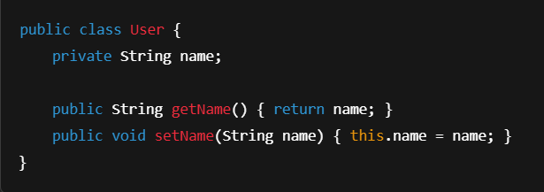
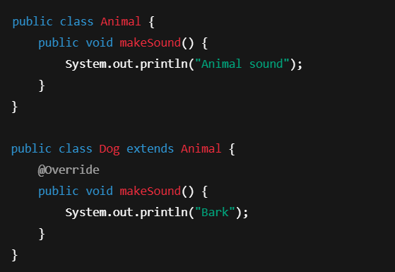
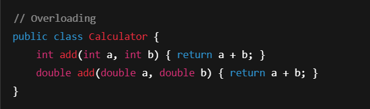
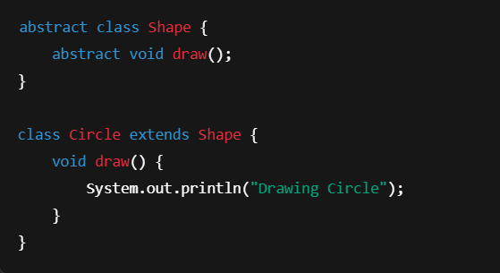

# 📌 Object-Oriented Programming (OOP) Principles
This is follows core Object-Oriented Programming (OOP) principles to ensure clean, modular, and maintainable code. Below are the four main pillars of OOP used in this codebase:

## 🔐 1. Encapsulation
- is the practice of hiding internal data and functionality of an object from external entities and providing a well-defined public interface for accessing and manipulating that object.
- encapsulation is implemented through access modifiers such as private, public, and protected, which control the visibility of class members such as fields and methods. Private members can only be accessed within the same class, whereas public members can be accessed anywhere in the program. Protected members can be accessed within the same class, subclasses, and classes in the same package.
- it helps maintain the data's integrity and prevents it from being accessed or modified in unintended ways. By hiding an object's internal data behind a public interface, 
-  it provides a mechanism for information hiding, which helps reduce the code's complexity and makes it easier to maintain and modify.

**Code Examples**

## 🧬 2. Inheritance
- Allows a class to inherit fields and methods - from another class.
- Promotes code reusability 
 - logical hierarchy.
- Used wherever shared behavior exists.
 
 **Code Examples**
 

## 🌀 3. Polymorphism
- Enables objects to take on many forms depending on context.
- Method Overriding (Runtime polymorphism)
- Method Overloading (Compile-time polymorphism)

**Over Loading**

## 🌫️ 4. Abstraction
- Hides complex logic and shows only essential features.
- Achieved using abstract classes or interfaces.
- Helps in designing loosely coupled systems.

**Code Examples**
